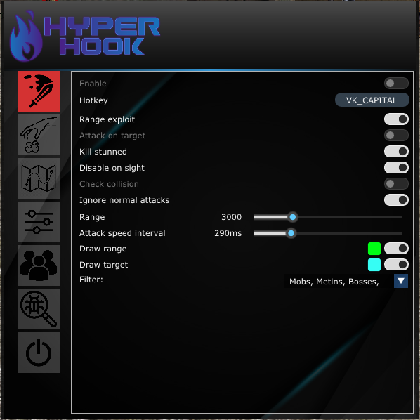
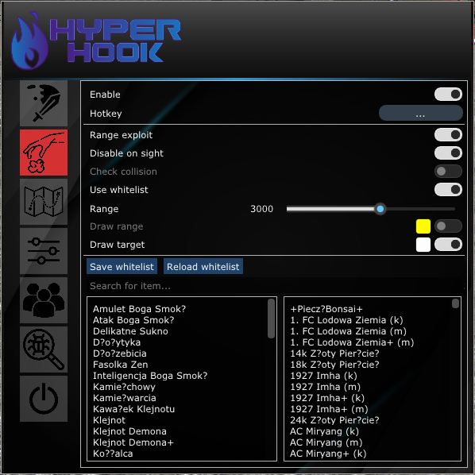
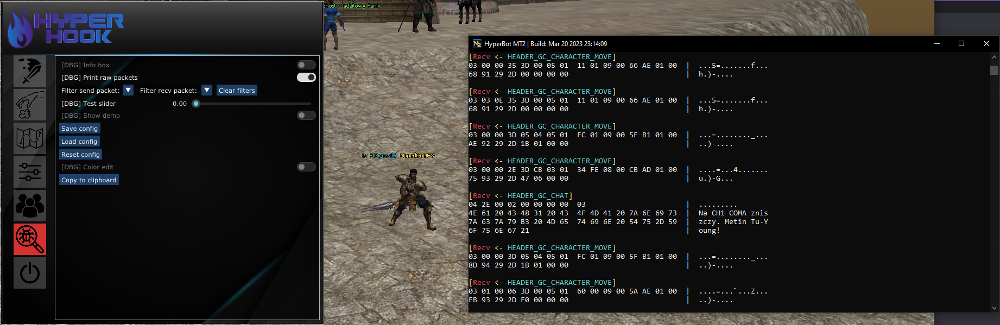

# HyperBot Nerwia2

## Overview
**HyperBot** is a multifunctional program designed to automate gameplay on the private server Nerwia2 (**Metin2**) in the form of a dynamically linked library. The project includes the complete source code of the bot, its functions and resources, as well as a simple injector utilizing **LoadLibrary()**. 
The project was developed between 2022 and 2023, it is likely not compatible with the current version of the Nerwia2 client. Due to this reason and upon requests from several individuals, it is being made available to the rest of the community.

## Technologies and Tools
- **Programming Language**: Entirely written in C/C++20.
- **Development Environment**: Developed using Microsoft Visual Studio and DirectX8 API.

## Features
### Attack:
- **Wait hack**: Well-known exploit within the community enabling attacks on multiple targets in a short period, bypassing attack animations.
- **Range exploit**: Enables attacking a target from huge distance.
- **Attack on target**: Attacks the target with the highest possible speed.
- **Kill stunned**: Kill targets swiftly to acquire loot faster.
- **Disable on sight**: Deactivates attack functions when visible to players/GMs.
- **Check collision**: Verifies target position validity before attacking/teleporting; automatically adjusts if invalid.
- **Draw functions**: Visualizes targets and range for **Wait hack**.

### Item Pickup:
- **Pickup**: Automatically collects any pick-upable item.
- **Range exploit**: Same as above.
- **Disable on sight**: Same as above.
- **Check collision**: Same as above.
- **Whitelist**: Allows creation of a custom list of items to pick up, with the option to dump the entire client item list.
- **Draw functions**: Visualizes pick-up targets and range.

### Route Creator:
- Enables recording and replaying gameplay in various scenarios. Have GUI support for creating custom maps for the bot with added events.

### Player List:
- Displays a list of nearby players categorized by Name, Level, GM flag, Empire, and Race. Originally intended for editing the black/white list targets for **Wait hack**, but remained unfinished.

### Miscellaneous:
- **Speed boost**: Allows faster movement.
- **Check collision (with speed boost)**: Ensures the player stays within the map boundaries and adjusts position accordingly.
- **Disable camera collision**: Yes.
- **Mob wallhack**: Allows passage through units (players and NPCs).
- **Wallhack**: Bypasses client's player collision checks.
- **No fly**: After attacking a target, prevents it from being knocked back.
- **Auto buff**: Automatically buffs specified player when the appropriate class is chosen.
- **Info box**: Displays information such as FPS, player count, mob count, nearby Metins, and packets sent in real-time.
- **Print raw packets**: Provides a user-friendly visualization of incoming/outgoing packets to/from the client.
- **Config**: Enables saving program settings.

## Media
### Menu:

### 'Gameplay':

## Installation and Usage
1. **Environment**: Compatible with Windows 10/11 x64/x86.
2. **Dependencies**: Requires Microsoft Visual C++ Redistributable, DirectX8/9. Additionally, [MinHook](https://github.com/TsudaKageyu/minhook) x86 static library needs to be compiled from source and placed in the project directory.
3. **Visual Studio Project**: Compilation is only supported in x86 architecture, as required by **Metin2**.

### Compilation Steps:
1. Clone the repository.
2. Place the compiled **MinHook** library in the project folder.
3. Open the Visual Studio project.
4. Compile the project in x86 architecture.

### Usage:
0. Update all addresses and signatures (if you want to make that program works properly in updated client).
1. Ensure all dependencies are installed.
2. Launch the game client.
3. Inject the compiled library into the game process using compiled injector or your own.
